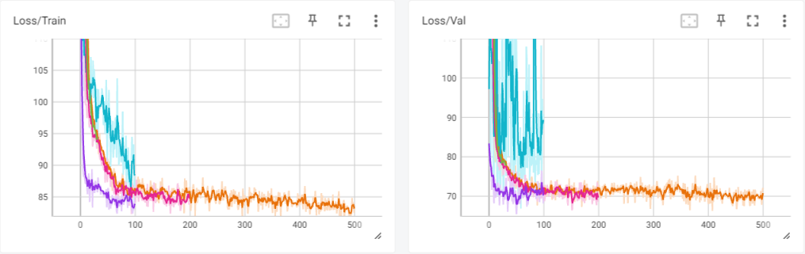
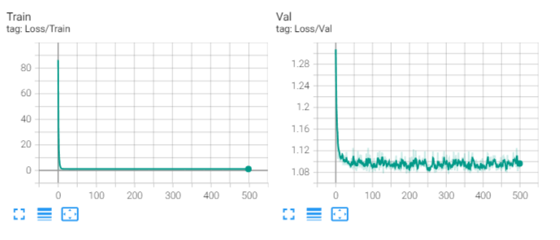

# Modelling Airbnb property listing dataset

Build a framework to systematically train, tune, and evaluate models on several tasks that are tackled by the Airbnb team.

## Milestone 1:  Set up the environment

First, we clone the listing images and raw data into a GitHub repository.

## Milestone 2: System Overview

We are about to start developing a framework for evaluating a wide range of machine learning models that can be applied to various datasets. Let's get started by watching an introduction video.

## Milestone 3: Data Preparation

Data comes in two folders: tabular data and images. We start by taking a look at tabular data inside listing.csv. There's quite some work to do to clean the data here. We wrote a few functions inside tabular_data.py that take care of:

- Listings with missing ratings.
- "Description" and "Amenities" columns contain lists of strings instead of a string. They also contain newline characters and duplicate phrases that need removing.
- Missing values in "guests", "beds", "bathrooms", "bedrooms".

All data cleaning functions are grouped inside **clean_tabular_data** function inside the __name__ == "__main__" block.

## Milestone 4: Create a Regression Model

After we cleaned the data, we took only numeric data to generate regression models to predict the price per night for each listing. All models and functions were created inside regression.py file and models with their hyperparameters and metrics saved in models/regression/ folder.

We used Regression Models from Scikit-Learn library and compared them to find the best one.

Data preprocessing steps that we took on numeric data in the previous step were encoding ordinal features, imputing missing values and feature scaling. Taking it a step further we could have done some feature selection and checking for outliers as well.

Starting point was the default SGD Regressor without any fine tuning. Next two models were the same SGD Regressor but fine tuned using GridSearchCV and a custom fine tune function. We also tried GridSearchCV on a Decision Tree model, Random Forest model and a Gradient Boosting Regressor.

Best performance was achieved with the SGD Regressor with the custom fine tuning function, which gave the lowest value validation RMSE and highest value validation R_squared.

| Regression Model Name            | Val RMSE          | Val R_squared          |
| -------------------------------- | ----------------- | ---------------------- |
| SGD (no fine tuning)             | 80.74             | 0.384                  |
| **SGD + Custom fine tuning**     | **78.93**         | **0.412**              |
| SGD + GridSearchCV               | 81.26             | 0.376                  |
| Decision Tree + GridSearchCV     | 86.77             | 0.289                  |
| Random Forest + GridSearchCV     | 81.56             | 0.372                  |
| Gradient Boosting + GridSearchCV | 85.61             | 0.308                  |

## Milestone 5: Create a Classification Model

Again, using just the numeric tabular data, we trained classification models to predict which "Category" each listing falls into. All models and functions were created inside classification.py file and models with their hyperparameters and metrics saved in models/classification/ folder.

All models were fine tuned with sklearn GridSearchCV.

| Classification Model Name            | Val Accuracy |
| ------------------------------------ | ------------ |
| Logistic Regression (no fine tuning) | 0.392        |
| Logistic Regression  + GridSearchCV  | 0.408        |
| Decision Tree + GridSearchCV         | 0.320        |
| Random Forest + GridSearchCV         | 0.344        |
| Gradient Boosting + GridSearchCV     | 0.344        |

Best performing was Logistic Regression + GridSearchCV with 0.408 validation accuracy.

## Milestone 6: Create a configurable neural network

Taking the regression problem of predicting nightly listing prices a step further, we designed a configurable neural network, that can be easily used customized just by modifying the **nn_config.yaml** file. We then used different configuration combinations to fine tune the neural net and get the best model, which was then saved to models/neural_networks/regression folder. Training was visualized using Tensorboard. Code can be found in **neural_net_reg.py**.

After fine tuning, we got the best model with **validation RMSE_loss 69.24 and R_squared 0.425**.

Best Hyperparameters: {'learning_rate': 0.01, 'hidden_layer_width': 50, 'num_epochs': 100}

Best Metrics: {'train': {'RMSE_loss': 82.37518584891541, 'R_squared': 0.4945861190742612, 'inference_latency': 0.00013928290071158573}, 'va290071158573}, 'val': {'RMSE_loss': 69.244868516922, 'R_squared': 0.4258490691013298, 'inference_latency': 0.000143613815{'RMSE_loss': 86.33076172}, 'test': {'RMSE_loss': 86.39434063434601, 'R_squared': 0.3407769412524374, 'inference_latency': 0.0001447854503508537}}

## Milestone 7: Reuse the framework for another use-case with the Airbnb data

Our final task was to reuse the classification shallow algorithms and repurpose the neural net for a classification problem, using the 'bedrooms' column as the label.

Shallow algorithms inside classification.py could easily be reused just by replacing the 'label' keyword argument when loading the dataset.

Neural net needed some tweaking to get it do classification instead of regression:

- Loss function needed changing to **nn.CrossEntropyLoss**.
- Evaluation metrics needed changing to accuracy, precision, recall, and F1-score.

Classification neural net was saved into **neural_net_class.py**.

| Classification Model Name            | Val Accuracy |
| ------------------------------------ | ------------ |
| Logistic Regression (no fine tuning) | 0.704        |
| Logistic Regression  + GridSearchCV  | 0.728        |
| Decision Tree + GridSearchCV         | 0.760        |
| **Random Forest + GridSearchCV**     | **0.808**    |
| Gradient Boosting + GridSearchCV     | 0.784        |
| MLP Classifier                       | 0.792        |

### RandomForestClassifier was the best performing shallow algorithm

Best Hyperparameters:

- Criterion: gini,
- Max_depth: 10,
- Max_features: sqrt,
- Min_samples_leaf: 1,
- Min_samples_split: 5,
- N_estimators: 100.

Best Metrics:

- Train_accuracy: 0.967,
- Validation_accuracy: 0.808,
- Test_accuracy: 0.782.

### MLP Classifier gave a slightly lower value of 0.792

Best Hyperparameters:

- Learning_rate: 0.001,
- Hidden_layer_width: 100,
- Num_epochs: 500.

Best Metrics:

- Training
  - Accuracy: 0.774,
  - Inference_latency: 3.196e-05,
  - CrossEntropyLoss: 0.702.

- Valuation:
  - Accuracy': 0.792,
  - Inference_latency: 3.214e-05,
  - CrossEntropyLoss: 0.715.

- Test:
  - Accuracy: 0.774,
  - Inference_latency: 3.225e-05,
  - CrossEntropyLoss: 0.742.

